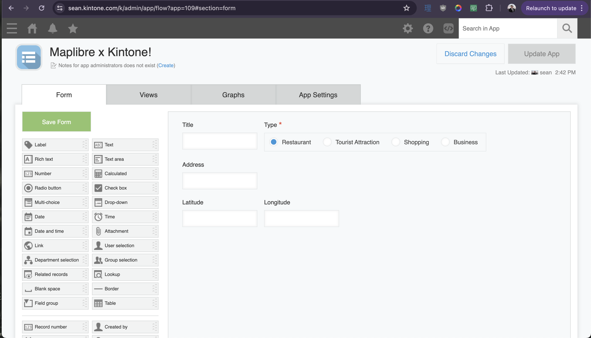
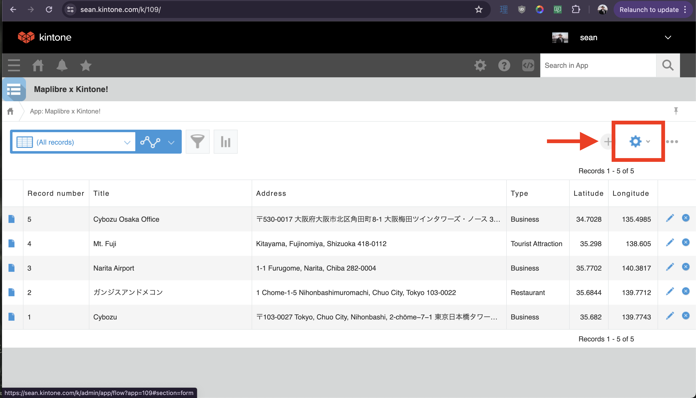
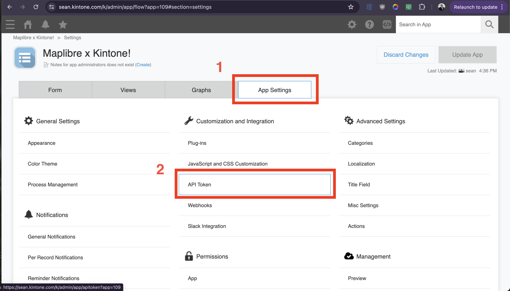
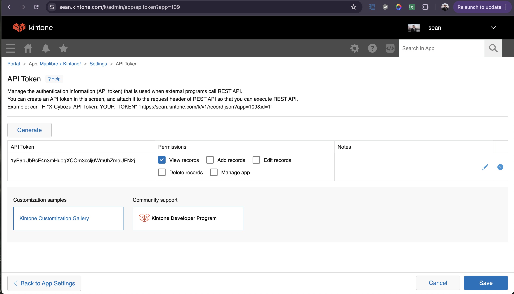

# maplibre-kintone
A demo showing MapLibre using Kintone for Data Points

## Install Steps

1. Clone the repo
2. `cd maplibre-kintone`
3. `npm install`
4. `cp .env.example .env`
5. `npm run dev`
6. Then a new terminal window...
7. `cd backend`
8. `npm install`
9. `node server.js`
10. In your browser, navigate to [localhost:5173](localhost:5173). If you see a map, you are ready!

## Setting up the Kintone App

|  | Field Type | Name | Field Code |
|---|---|---|---|
| 1 | Text | Title | title |
| 2 | Text | Address | address |
| 3 | Radio button | Type | type |
| 4 | Number | Latitude | lat |
| 5 | Number | Longitude | lon |
|  |  |  |  |

## Populate the Database with Data

| Title | Address | Type | Latitude | Longitude |
|---|---|---|---|---:|
|Mt. Fuji | Kitayama, Fujinomiya, Shizuoka 418-0112 | Tourist Attraction | 35.298 | 138.605 |
|Narita Airport | 1-1 Furugome, Narita, Chiba 282-0004 | Business | 35.7702 | 140.3817 |
|ガンジスアンドメコン | 1 Chome-1-5 Nihonbashimuromachi, Chuo City, Tokyo 103-0022 | Restaurant | 35.6844 | 139.7712 |
| Cybozu | 〒103-0027 Tokyo, Chuo City, Nihonbashi, 2-chōme−7−1 東京日本橋タワー２７階 | Business | 35.682 | 139.7743 |

## Get your API Token

Make sure to give `View Records` permission to the token, and update the App!